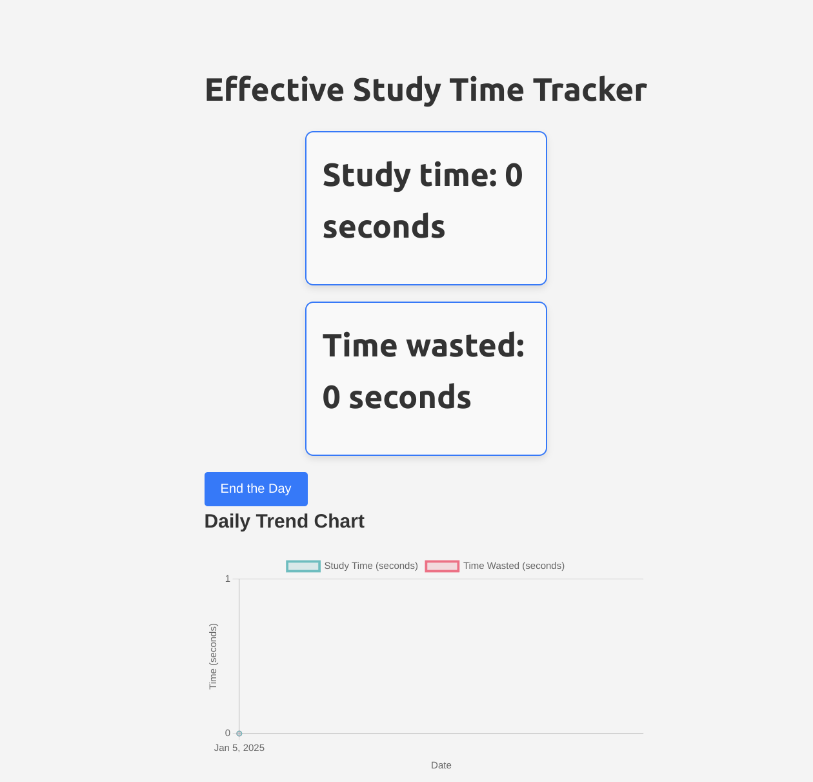

# EffiSwitch

EffiSwitch is a productivity tool designed to reduce attention span attrition faced by students. It helps users track their study time and time wasted, providing insights into daily productivity trends through an intuitive dashboard and visual charts.

## Features

1. Track Study Time: Log the time spent studying.

2. Monitor Time Wasted: Track distractions and unproductive activities.

3. Trend Analysis: Visualize daily productivity trends using interactive charts.

4. Insights: Gain actionable insights to improve focus and efficiency.

5. User-Friendly Interface: Simple and intuitive design for seamless usage. Click on panels to switch.

## Technologies Used

### Frontend

1. React: A JavaScript library for building user interfaces.

2. Chart.js: For rendering interactive and responsive charts.

3. Axios: For making HTTP requests to the backend.

### Backend

1. Python: Primary programming language.

2. FastAPI: A modern, fast (high-performance) web framework for building APIs.

3. SQLAlchemy: An ORM (Object-Relational Mapping) tool for database interactions.

4. PostgreSQL: A powerful, open-source relational database system.

### Other Tools

1. Docker: For containerization and easy deployment.

2. Git: For version control and collaboration.

### Installation

#### Prerequisites

1. Node.js (for frontend)

2. Python 3.8+ (for backend)

3. PostgreSQL (for database)

4. Docker

#### Steps

Clone the Repository:

```
git clone <https://github.com/your-username/effiswitch.git>
cd effiswitch
```

Set Up Environment Variables:

Create a .env file in the backend directory with the following content:

```

DATABASE_URL=postgresql://user:password@db:5432/effiswitch

```

Replace user and password with your PostgreSQL credentials.

Build and Run the Docker Containers:

Run the following command to build and start the containers:

```

docker-compose up --build

```

This will:

1. Build the Docker images for the frontend, backend, and database.

2. rt the PostgreSQL database.

3. Run the FastAPI backend.

4. Serve the React frontend.

### Access the Application

Once the containers are up and running, open your browser and navigate to:

```

Frontend: <http://localhost:3000>

Backend API: <http://localhost:8000>

```

### Stop the Containers

To stop the containers, press Ctrl + C in the terminal where Docker Compose is running.

The docker-compose.yml file defines the services for the application:

```

version: '3.8'

services:
  backend:
    build: ./backend
    ports:
      - "8000:80"
    env_file:
      - ./backend/.env.backend
    depends_on:
      db:
        condition: service_healthy
    # command: ./wait-for.sh db python app.py
    volumes:
      - ./backend:/app
    healthcheck:
      test: ["CMD", "curl", "-f", "http://localhost:80/health"]
      interval: 30s
      timeout: 10s
      retries: 3

  frontend:
    build: ./frontend
    ports:
      - "3000:3000"
    env_file:
      - ./frontend/.env.frontend
    depends_on:
      - backend
    volumes:
      - ./frontend:/app
      # - /app/node_modules

  db:
    build: ./postgres
    env_file:
      - ./postgres/.env.db
    ports:
      - "5432:5432"
    volumes:
      - postgres_data:/var/lib/postgresql/data
      # - ./postgres:/docker-entrypoint-initdb.d/
    healthcheck:
      test: ["CMD-SHELL", "pg_isready -U user -d my_database -h db"]
      interval: 10s
      timeout: 5s
      retries: 5

volumes:
  postgres_data:

```

### Usage

Log Study Time:

Use the stopwatch feature to log study sessions.

Categorize activities as "Study time" or "Time wasted."

#### View Trends

1. Navigate to the dashboard to view daily productivity trends.

2. Analyze charts to identify patterns and areas for improvement.

#### Optimize Productivity

Use insights from the dashboard to reduce distractions and improve focus.

#### Screenshots



#### Contributing

We welcome contributions! If you'd like to contribute to EffiSwitch. Fork and submit a pull.

1. Add ollama to create a GenAI tech stack and add to your portfolio.
1. Write migration script to backup your database and restore
1. Use nginx and deploy to cloud

#### License

This project is licensed under the MIT License. See the LICENSE file for details.

#### Acknowledgments

Inspired by the need to combat attention span attrition among students.

#### Contact

For questions or feedback, feel free to reach out:

Thank you for using EffiSwitch! We hope it helps you stay focused and productive. 🚀
